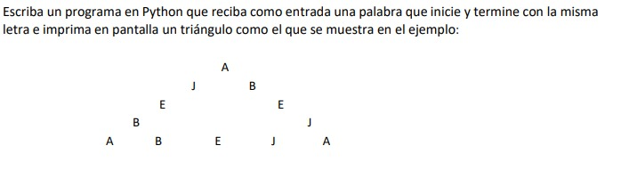

# Pirámide con Reflejo

Este ejercicio me lo pasó alguien de la universidad, me tomó casi 2hr realizarlo debido a que tenía oxidado el Python. Es básicamente como un híbrido entre el ejercicio de palíndromos y el ejercicio de mostrar un patrón pirámide con * típico de exámenes de algoritmos. Lo que lo lleva al siguiente nivel es el espaciado y la necesidad de mostrar una base y un "reflejo" entre las letras que van y vienen.

## Ejercicio

## Explicación

Lo hice aplicando ✨La Recursividá💅🏼✨;llamando a la misma función y no usando las especialidades de python (para más palcer); usando como caso base el inicio y final de la recursión. Aquí lo único que hago es simplemente definir el espaciado e invertir cada letra según el índice o escalon en el que se encuentre la jerarquía de la recursión. Con esto solo es jugar un poco con dicho índice para calcular cuanto se separa cada letra.

### Complejidad

La complejidad que maneja el algoritmo, al estar basada en recursividad sencilla de calcular, ya que el stack del llamado de la función solo va a llegar a lo mucho al límite de la longitud de la cadena que se ingrese por lo que la complejidad dependerá del length de la misma, o lo que es lo mismo O(N)