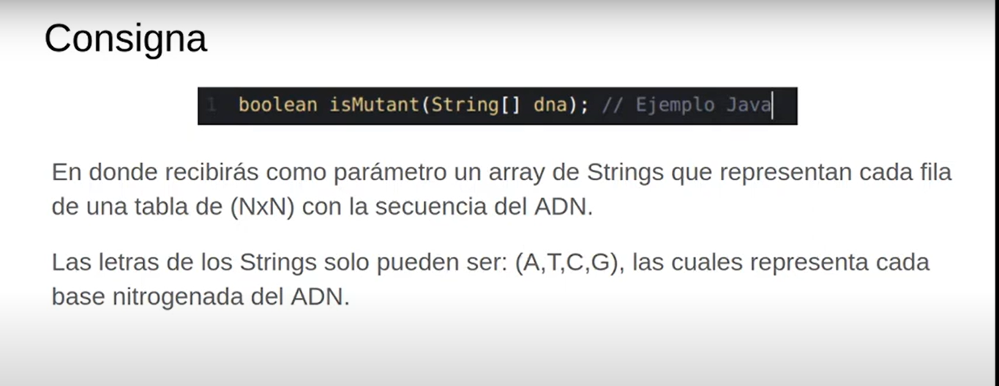
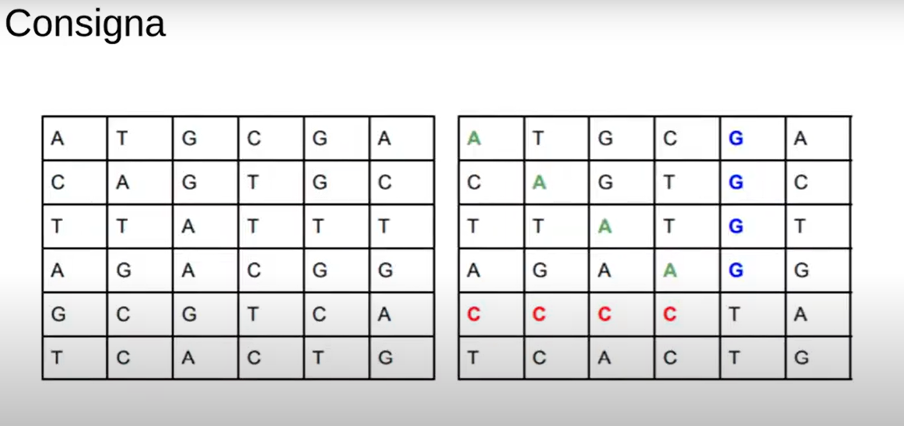
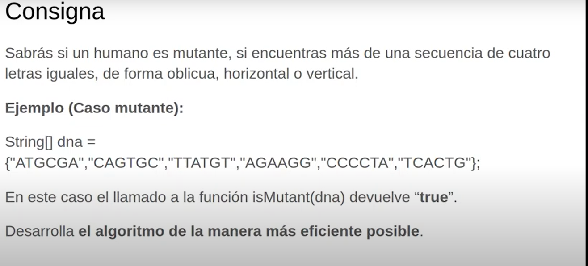

# X-men DNA Mutant Validator

Esta prueba técnica la saqué de Youtube, de un vídeo de 2020 [MercadoLibre: examen de ingreso]([/guides/content/editing-an-existing-page](https://www.youtube.com/watch?v=as_6ZDQQzac&t=131s&ab_channel=GonzaloMendoza))
, Gonzalo Mendoza da una idea a aproximada de cómo resolverlo pero no da el Codigo fuente, además el lo resuelve en Java, sin embargo aquí se resuelve en Typescript. Vean más abajo de la explicación del ejercicio la forma en como yo explico la manera en cómo lo abordé.

**Nota:** Para correr este ejercicio solo necesitan instalar los paquetes ```npm install```  y luego ejecutar el comando ```npm run dev```

## Ejercicio





## Explicación

Dividí el problema en dos partes:

1. ```findVerticalAndHorizontal: ``` En la primera intenté recorrer la matriz de tal forma que los dos loops principales me dieran la oportunidad de extraer tanto las palabras que se encuentran en vertical, como las que están en horizontal, de esta forma estoy tratando de disminuir almenos un poco la complejidad del algoritmo ya que, al ser un único recorrido por la matriz para extraer valores de diferentes ejes, se hace más ligero el programa.
2. ```findDiagonal: ``` Por otro lado, con este método pretento llevay un acercamiento como el anterior, solo que en este caso uso un mismo recorrido pero esta vez extrayendo 4 posibles valores de ejes; es decir, partí la matriz en diagonal principal y también en secundaria y luego hice la extracción de los valores de lado a lado por cada segmento.

Encontrarán dos funciones auxiliares que son ```validateDNA``` y ```findValidSequence``` que son simplemente una para validar los constraints y otra para evaluar todas las posibles palabras que tengan 4 letras iguales que salgan de cada uno de los segmentos que vaya armando por "eje".

Las funciones principales devuelven una lista de todas las combinaciones posibles que se encontraron en toda la matriz segun cada recorrido. Esto al final solo lo concateno y valido que haya más de un elemento en el array saliente.

### Complejidad

La complejidad de la solución sería O(N^2) ya que todo el tiempo lo que se está haciendo es recorrer "la matriz" de manera trasversal a sus ejes bidimensionales, por lo cual, cada recorrido tendría una complejidad de O(N) para un total de O(N^2).
